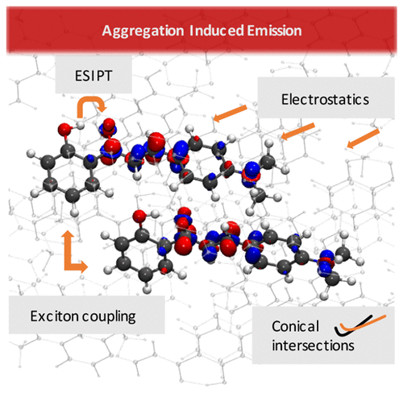
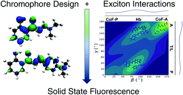
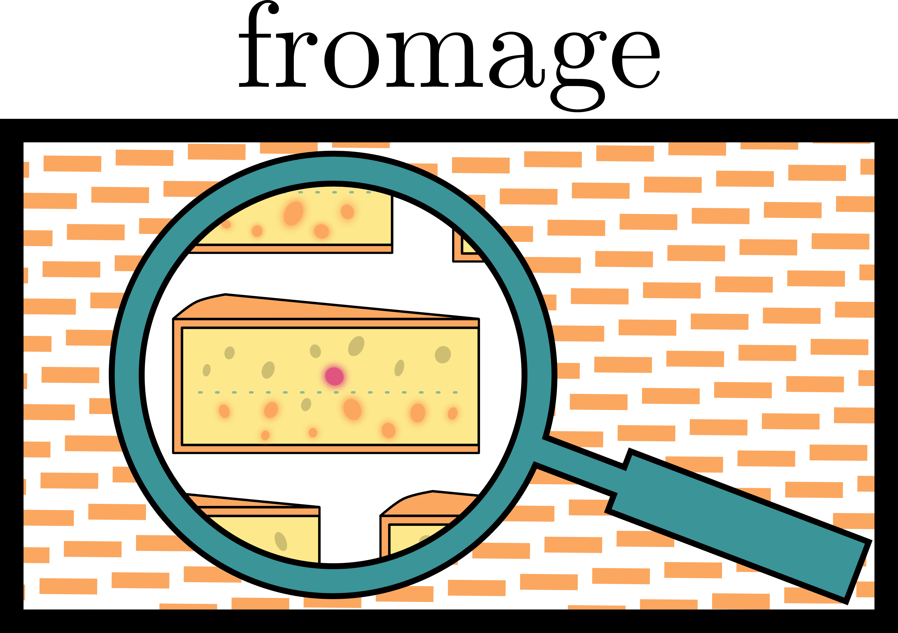

# Research

## Pleasantries

 A wrinkled page, smelling of pickle and sulphur. You have found my
 publications list, each paper is accompanied by a description of the arcane
 magics within.  They should be appreciable by visiting wizards of any school
 of magic. If your area of arcana matches mine, mind that this will be rife
 with generalisations, and be sure to inspect the original tomes for a more
 rigorous account.

## Overview
 Currently, all of my publications relate in some way to <i>organic molecular
 crystals</i>, that is, the state of matter where molecules, made up of mostly
 carbon, stack together like Lego bricks in order to form a solid. An ice cube,
 for example, is a molecular crystal of water (though not an organic one). An
 example of an organic molecular crystal would be a paracetamol tablet.

 Organic molecular crystals have many applications, and I am in particular
 interested in their uses which have to do with light. They are used as
 materials for lasers, solar pannels, electronics, sensors in the bloodstream
 for medical applications, and LEDs (you might have heard of OLEDs). These
 materials are light, sometimes flexible, and made up of very common atoms,
 making them more sustainable than ones which require rare elements.

 In order to discover and design them, it is extremely handy to be able to
 model them on a computer. This way, instead of spending millions of hours and
 chemicals in a lab trying out different experiments, you spend hundreds of
 hours and coffee pots in front of a computer, trying out different
 calculations.  Once you have narrowed down some nice candidate, you can send
 over the recipe to some experimental chemists, who can actually build the
 thing, end hopefully build some new material.

 My role in this picture is to write the programs which model the crystals in
 question. I design the mathematical tools to model the quantum physics of
 light interacting with the material, and then translate them into computer
 programs, which supercomputers are able to understand.

## List of Publications

- **How inter-and intramolecular processes dictate aggregation-induced emission
  in crystals undergoing excited-state proton transfer**

    Michael Dommett, **Miguel Rivera**, Rachel Crespo-Otero, <a
    href="https://pubs.acs.org/doi/10.1021/acs.jpclett.7b02893"><i>J.  Phys.
    Chem. Lett.</i> 2017, **8**, 6148-6153</a>

    

      
    

    This was an investigation into an unusual property of some organic
    molecular crystals called <i>Aggregation Induced Emission</i> (AIE).
    Normally, if molecules emit light when they are dissolved in a solvent
    (e.g. water), when they are brought together (aggregated) to form a
    crystal, they stop emitting. In certain cases, the opposite process is
    true, where a molecule which is dark when dissolved starts emitting as a
    crystal, thus the name 'Aggregation Induced Emission'.

    We are usually interested in light-emitting crystals rather than solutions
    for technological applications, since they are solids rather than liquids,
    therefore being able to predict which dark molecules in solution would
    become bright in crystal would be very useful. Unfortunately the reasons
    for AIE are still poorly understood, and this paper makes progress in this
    direction.

    We focused on a family of molecules used in lasers which have a hydrogen
    atom moving from one part of the molecule to the other when they absorb
    light. An important point to understand here is that before being able to
    emit any kind of light, the molecules first need to absorb light, there is
    never an emission of light coming from nowhere. Thus, whatever determines
    AIE will have a lot to do with what happens to the molecule after it
    absorbs light. In this case, the hydrogen moving across the molecule
    changes a lot about how the atoms move, and can sometime lead to the
    material losing the energy from the absorbed photon without emitting any
    photon in return (through heat).  This is why we care about 'excited state
    proton transfer' molecules. 'Excited state' means after absorption, and a
    'proton' is the name of the hydrogen nucleus, therefore the title of the
    paper refers to crystals made up of molecules which have hydrogens hopping
    around upon absorbing a photon.

    In this family of molecules, some had AIE, while others remained dark in
    the crystal, despite the difference between the molecules being of only a
    few atoms. It surfaced that the seemingly small change at the scale of the
    molecule amplified into a large change in how into how it stacked together
    to make a crystal. You can understand it like this: if you were playing
    Jenga with L-shaped blocks, you wouldn't be able to stack the tower in the
    usual way, you would have to come up with a more elaborate architecture.
    The same was true for these crystals. Therefore there were changes within
    the molecule itself (intra-) and between the molecules due to the stacking
    (inter-). These changes were subtly correlated, making it impossible to
    understand how one affected AIE without the other. The main point of view
    of the paper was to understand the interplay between these inter- and
    intramolecular processes, as the title suggests.

    This was mostly the work of my groupmate Michael, though I helped in
    designing and adapting tools to model the 'excited state' molecule (read:
    molecule after absorbing a photon) whilst taking into account the fact that
    it was within a crystal.

***

- **ONIOM(QM:QM′) Electrostatic Embedding Schemes for Photochemistry in
  Molecular Crystals**

    **Miguel Rivera**, Michael Dommett, Rachel Crespo-Otero, <a
    href="https://pubs.acs.org/doi/10.1021/acs.jctc.8b01180"><i>J. Chem. Theory
    Comput.</i> 2019, **15**, 2504-2516</a>, <a
    href="https://chemrxiv.org/articles/ONIOM_QM_QM_Electrostatic_Embedding_Schemes_for_Photochemistry_in_Molecular_Crystals/7364768">preprint</a>

    

      
    

    This was my first paper as lead author, and ended up being quite the
    behemoth, being the longest one written during my PhD. In here, we
    presented a new strategy to model molecules interacting with light in a
    crystal environment.

    Molecules which have absorbed light are said to be in an 'excited state',
    as opposed to the 'ground state'. They are much more costly to model since
    ground states are the lowest possible energy available to the electrons in
    the molecule. Therefore there is a systematic way of finding a ground
    state: try a wavefunction (the quantum representation of the electrons),
    and change it until it reaches its lowest energy. The process is much more
    complicated for excited states.

    Therefore modelling the excited states of a crystal would be impossibly
    costly, even for a supercomputer, since the amounts of atoms within a
    crystal are counted in units of 1023. Fortunately for us,
    organic molecular crystals are not bound together very strongly, which has
    the consequence that the excited states in these systems stay on one or two
    molecules, instead of immediately hopping to the whole crystal in one go.

    We would therefore like to model one or two (I will use the singular from
    now on for ease of use) molecules in the excited state. However the fact
    that they are inside a huge (for our purposes infinite) array of ground
    state molecules should affect the excited state in some way. In this paper,
    we developed a way of combining several ground and excited state
    calculations to model one central molecule in the excited state,
    surrounded by molecules in the ground state taken from their theoretical
    positions in the crystal. This combination of methods is based on a
    previously designed method called ONIOM (Our own N-layered Integrated
    Molecular Orbital and Molecular mechanics). The full name is somewhat
    cryptic, but the acronym is meant to conjure the image of an onion, with
    layers modeled with different levels of theory (excited state, ground
    state, or even non-quantum methods). In this case, we care about using
    quantum methods for both layers of our onion, thus the method is said to be
    an ONIOM QM:QM' method where QM stands for Quantum Mechanics, and the
    apostrophe indicates that it is not the same as the previous QM.

    By using ONIOM, the excited state was represented, taking into account all
    the interactions between it, and its nearest neighbours. However, the
    interactions between molecules have many components, some of which reach
    further than just the neighbouring molecules. In particular, electrostatic
    interactions have a range spanning thousands of atoms, but we are only in a
    position to model quantum ground states of the order of hundreds. To
    address this problem, we embedded the onion of excited and ground state
    molecules in a huge array of placeholder points called 'point charges'.
    These accounted for the electrostatic interactions we were after, without
    having to calculate the wavefunction of thousands of atoms. Additional
    tweaks were tested out like, using variable amounts of point charges with
    different values, or making the values of the point charges change as a
    reaction to the molecule absorbing light.

    These new method was validated returning to the investigation of a couple
    of molecules previously studied by our group here: <a
    href="https://pubs.acs.org/doi/10.1021/acs.jpclett.7b02893"><i>J.  Phys.
    Chem. Lett.</i> 2017, **8**, 6148-6153</a>. One of the molecules was
    emissive in crystal whilst the other was not, and we wished to recover
    these results. Additionally, the prediction of the previously available
    methods was for the molecule to shine blue, but experimental evidence said
    that it should be red.

    The new ONIOM QM:QM' methods managed to reproduce the correct behaviour of
    the two molecules, and recover the correct colour. We found that using
    QM:QM' methods was important for this, as was extending the electrostatic
    interactions in the way described above. I implemented all of these methods
    into a program, which is described in a later publication.

***

- **Molecular and Crystalline Requirements for Solid State Fluorescence
    Exploiting Excited State Intramolecular Proton Transfer**

    Michael Dommett, **Miguel Rivera**, Rachel Crespo-Otero, <a
    href="https://pubs.rsc.org/en/content/articlelanding/2020/TC/C9TC05717J#!divAbstract"><i>J.
    Mater. Chem. C</i>, 2020, **8**, 2558-2568 </a>, <a
    href="https://chemrxiv.org/articles/Molecular_and_Crystalline_Requirements_for_Solid_State_Fluorescence_Exploiting_Excited_State_Intramolecular_Proton_Transfer/8283710">preprint</a>

    

      
    

    This was another great output by Michael. Essentially, he used the
    families of molecules from <a
    href="https://pubs.acs.org/doi/10.1021/acs.jpclett.7b02893"><i>J.  Phys.
    Chem. Lett.</i> 2017, **8**, 6148-6153</a>, only including even more
    species, and a neighbouring family, in order to have enough diverse results
    to start extracting statistical conclusions. The focus remained on
    molecules used in lasers as crystals, which had a hydrogen atom
    transferring across the molecule upon absorption of a photon.

    I don't want to go too far in depth on this one, but what is most valuable
    here, in my opinion, is the development of a systematic way of approaching
    the modeling of these systems. The aim was to be very comprehensive, so as
    to weigh and compare all of the factors which could determine the emission
    of light in these materials, or the absence thereof. By repeating this very
    broad and time-consuming analysis for all-in-all eleven molecules, Michael
    developed a workflow which we have since then used as a template for
    investigating new chemistries.

    The outcome was the formulation of a set of requirements for these proton
    transfer molecular crystals to be efficiently luminescent (very bright). We
    found that encouraging the transfer of the proton (i.e. hydrogen) was a
    strong contributing factor. Making the molecules stack in parallel
    arrangements was unfavourable for emission, but the transfer of the proton
    would usually trump this. Finally, making more rigid molecules would help
    encourage the emission of light, by discouraging the motions of the
    molecule which would allow it to lose its energy through heat and not
    photons.

    In this paper, I developed a few tools to measure how tightly packed the
    molecules were in their crystal environment. I also assessed the importance
    of the interactions from very far ranging molecules within the crystal on
    the behaviour of the excited state. Finally, I handled a significant
    portion of the revision process.

***

- **fromage: A library for the study of molecular crystal excited states at the
    aggregate scale**

    **Miguel Rivera**, Michael Dommett, Amir Sidat, Warda Rahim, Rachel
    Crespo‐Otero, <a
    href="https://onlinelibrary.wiley.com/doi/10.1002/jcc.26144"><i>J. Comput.
    Chem.</i>, 2020</a>, <a
    href="https://chemrxiv.org/articles/Fromage_A_Library_for_the_Study_of_Molecular_Crystal_Excited_States_at_the_Aggregate_Scale/9786041">preprint</a>

    

      
    

    This paper is maybe the most technical yet, but I made sure that all of the
    figures were very attractive, in order to not put off potential readers.
    This is an account of the program which compiles all of the tools developed
    during my PhD. **fromage** (FRamewOrk for Molecular AGgregate Excitations)
    is a Python library designed to assist in modeling excited states in
    molecular crystals. The need for it came about because, as discussed above,
    our perspective in this field encompasses molecules, clusters of molecules,
    and crystals, and these three orders of magnitude typically require
    different sets of tools to study.  **fromage** offers ways of jumping
    between the three both for newcomers (who are supplied with readymade
    programs to use) and experts (who can use parts of **fromage** in their own
    short programs).

    The bulk of the paper presents the readymade programs one by one,
    explaining how they work, showing how to use them, and concluding with an
    example for a real molecular crystal, relevant to applications to do with
    light. The series of programs had the following uses:
    - measure the available space for a molecule inside a crystal to wiggle
around
    - detect neighbouring pairs of molecules and measure their conformations
    - evaluate how much excited states involve neighbour molecules instead of
just the one
    - find how these excited states were shared between molecules calculate the
    - excited states whilst taking into account their crystalline
        environment, as is described here: <a
        href="https://pubs.acs.org/doi/10.1021/acs.jctc.8b01180"><i>J. Chem.
        Theory Comput.</i> 2019, **15**, 2504-2516</a>

    In the end this paper is more of a good way of advertising the program, and
    also provides something to cite for future users. The real bulk of the work
    is in <a href="https://github.com/Crespo-Otero-group/fromage">the source
    code</a> and <a href="https://fromage.readthedocs.io/en/latest/">the
    documentation</a> for **fromage**. Understanding the science is one thing,
    but it's really the object of the program itself which I am proud of, since
    at the beginning I didn't know any of the tools to make a sustainable
    program, a webpage, a tutorial, a cheese logo etc.

***

To find an up-to-date list, you may peruse my <a
href="https://scholar.google.co.uk/citations?user=jKqXsfAAAAAJ&hl=en">Google
Scholar</a>.
